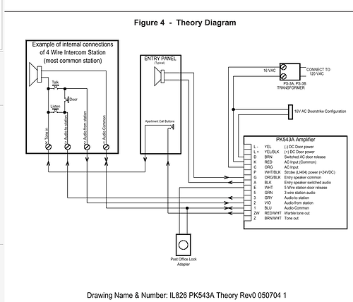

# whosthere-c

This is a program for esp32 to be hooked into a 4-wire intercom system.
It is written in C and still in heavy development


## Console
A console is available on the default UART. Use the help command to learn about functions.

This is mainly used for developping/debugging

## Talk

The talk function will bind UDP port 5000 and wait for RTP data (don't use extended headers).
The RTP payload has to contain 8 bit uncompressed audio, sampled at the configured
`CONFIG_AUDIO_SAMPLE_RATE` value (default to 44100 Hz).

Such data can be generated with Gstreamer:
```
gst-launch-1.0 -v filesrc location="in.mp3" ! \
    decodebin ! \
    audioresample ! \
    audioconvert ! \
    audio/x-raw,rate=44100,channels=1,channel-mask=1 ! \
    rtpL8pay auto-header-extension=false ! \
    udpsink host=<ESP32_IP> port=5000
```

The audio signal will be rendered on the GPIO25 pin.

## Listen

(TBD)

## Open door

(TBD)

## Notify ringing

(TBD)

## MQTT

(TBD)

## Electronic considerations

This is what is considered true for now but needs a lot more investigation.

In the unit station (where this code is running), the speaker is used as both speaker and microphone.

Here is a theory diagram of how the full system is working without the ESP32:



### Talking

As microphone, vibrations in the air move the membrane that moves the coil to
generate a small current.

It is believed that GROUND is coming on one side (See 1: Audio common on the
theory diagram) and the microphone is generating a small current in the form of
an analog sound wave.

This current is probably in the range of some mV and the central system amplifies it.

That means that the DAC output needs to be in the correct range to match the
microphone's. As the DAC is only 8 bits precision, the signal will have to be
electronically divided to avoid precision loss. The use of a
[Voltage Divider](https://en.wikipedia.org/wiki/Voltage_divider) should be
considered.

The actual wireing is not known yet as we would act as a power generator to
mimic the coil and we only get GROUND. TBD.

### Listening

In this case, the speaker is an actual speaker
([Estimated at 45 ohms, 24V, aka +/-12V, TBC](https://www.radwell.ca/Buy/MIRCOM/MIRCOM/RPL-SP-200) ).

To be able to make audible sounds, the signal from the microphone outside must
be amplified and that is the signal we get in the unit station.

This signal amplitude can be reduced with a [Voltage Divider](https://en.wikipedia.org/wiki/Voltage_divider)
but that is to be tested as well. In this case, Vout would give the correct
signal between 0 and 3.3v.

#### ADC precision

According to the ESP32 TRM, the higher the voltage, the less precise the is the
reading.
That can be solved by increasing the Voltage divider to be in the 0-1V range.
In the case, the attenuation of 11 dB could be avoided.